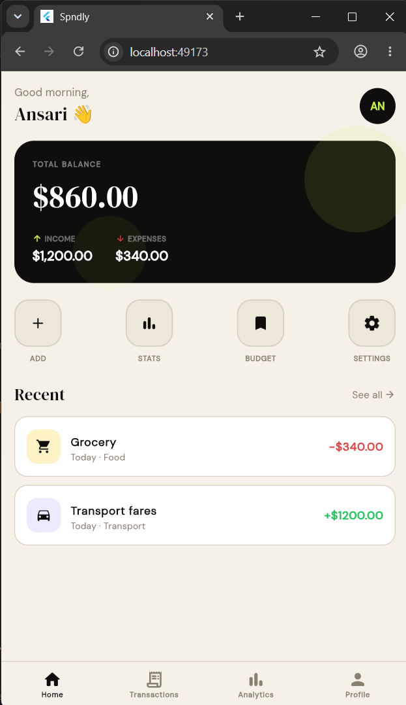
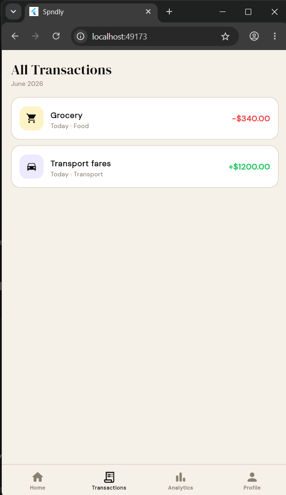
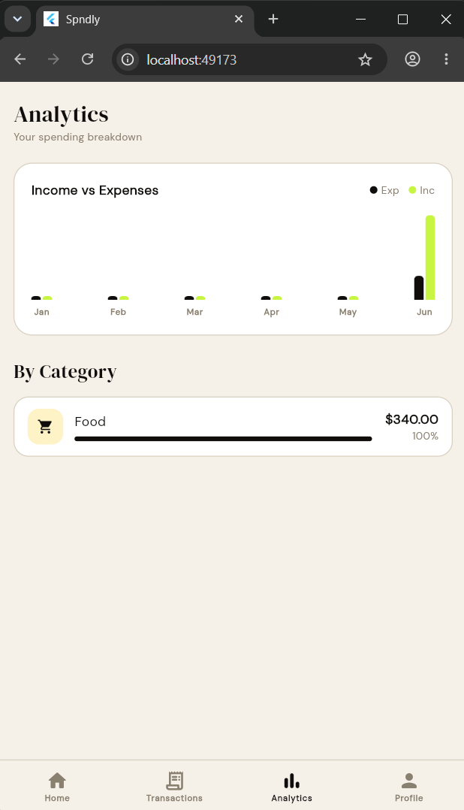
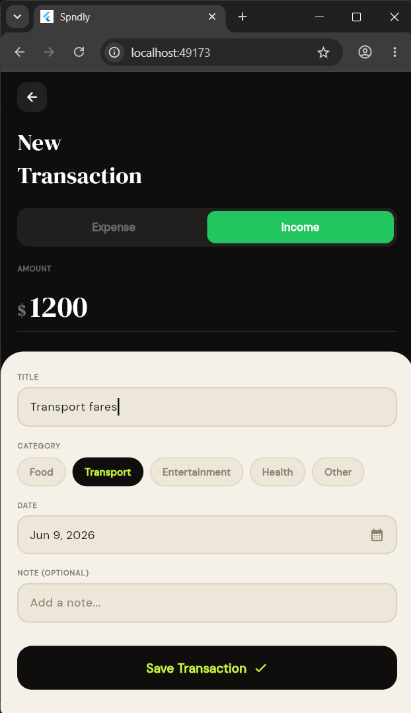
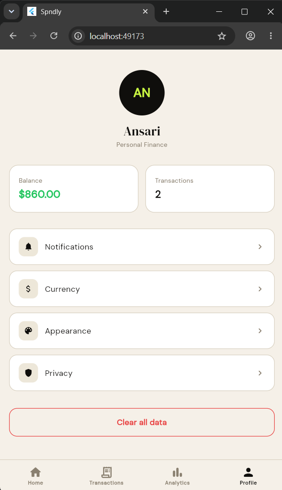

# Spndly 💸

A clean, modern personal expense tracking app built with Flutter. Spndly helps users monitor their spending habits through an intuitive interface and a visual analytics dashboard.

> This project is a UI implementation showcasing Flutter best practices — component architecture, dynamic theming, and Riverpod state management.

---

## 📱 Screens

| Screen | Description |
|---|---|
| Home | Overview of balance, recent transactions, and spending summary |
| Transactions | Full transaction history with categorized entries |
| Analytics | Visual breakdown of spending patterns and trends |
| Profile | User preferences and app settings |

---

## ✨ Features

- 📊 Analytics dashboard with visual spending breakdown
- 🎨 Dynamic theming with Material 3
- 🧩 Reusable, composable widget architecture
- 🔄 Riverpod state management
- 🧭 Bottom navigation with smooth transitions

---

## 🛠 Tech Stack

| Layer | Technology |
|---|---|
| Framework | Flutter |
| State Management | Riverpod |
| Theming | Material 3 / ThemeExtension |
| Language | Dart |

---

## 📸 Screenshots


| Home | Transactions | Analytics | Add Transaction | Profile |
|---|---|---|---|---|
|  |  |  |  |  |

---

## 🚀 Getting Started

### Prerequisites
- Flutter SDK installed
- Dart SDK installed

### Run the app

```bash
# Clone the repository
git clone https://github.com/ansari-devhub/flutter-expense-tracker.git

# Navigate into the project
cd flutter-expense-tracker

# Install dependencies
flutter pub get

# Run the app
flutter run
```

---

## 📁 Project Structure

```
lib/
├── main.dart
├── pages/
│   ├── home/
│   ├── transactions/
│   ├── analytics/
│   └── profile/
├── widgets/          # Reusable UI components
├── providers/        # Riverpod providers and state
├── models/           # Data models and entities
├── theme/            # Material 3 theming and ThemeExtension
└── utils/            # Helper functions and constants
```


## 👨‍💻 Author

**Ansari** — Flutter Developer
[GitHub](https://github.com/ansari-devhub) • [LinkedIn](https://linkedin.com/in/your-linkedin)

---

## 📄 License

This project is open source and available under the [MIT License](LICENSE).
